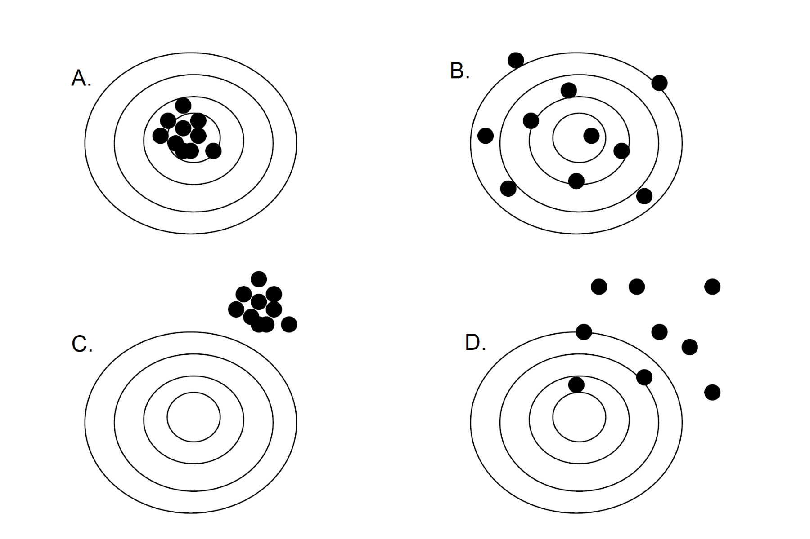

```{r}
library(knitr)
```


<br>

####Nombre del estudiante:

<br>

####1. Identifica los conceptos de precisión, sesgo, y exactitud en los diagramas siguientes.  Una pista, el diagrama B es no sesgado pero impreciso = inexacto.

```{r}

```

<br>

A:

B: no sesgado pero impreciso = inexacto

C:

D:

<br>

####2. Un investigador esta investigando algunas características morfométricas, tales como el peso corporal (g) y la longitud del pico (mm), de 2 especies de de pinzones africanos.

Datos: PinzonesAfricanos.csv

#####¿Cuál de las especies tiene el pico más largo?

a. Analiza el resultado desde el punto de vista del valor de P.
b. Analiza el resultado desde el punto de vista del tamaño del efecto.

<br>

####3. Muchas personas creen que para logar un estimado preciso de la media poblacional es necesario muestrear una fracción sustancial de la población.  Esta pregunta esta desarrollada para probar si tal aseveración es cierta o no.

a. Para una población con desvío estándar 50, encuentra el error estándar de los siguientes valores de N (tamaño de población) y n (tamaño de muestra).  Coloca los errores estándares calculados en las celdas vacías de la tabla.

<br>

```{r, echo = FALSE}
library(knitr)
library(data.table)
c <- data.table("N =" = c("n =", "Error estándar ="), "100" = c(10, ""), "1000" = c("100", ""), "10000" = c("1000", ""), "1000000" = c("10000", ""), "10000000" = c("1000000", ""))
kable(c)
```

b. Se te ocurre alguna explicación de los resultados obtenidos.


