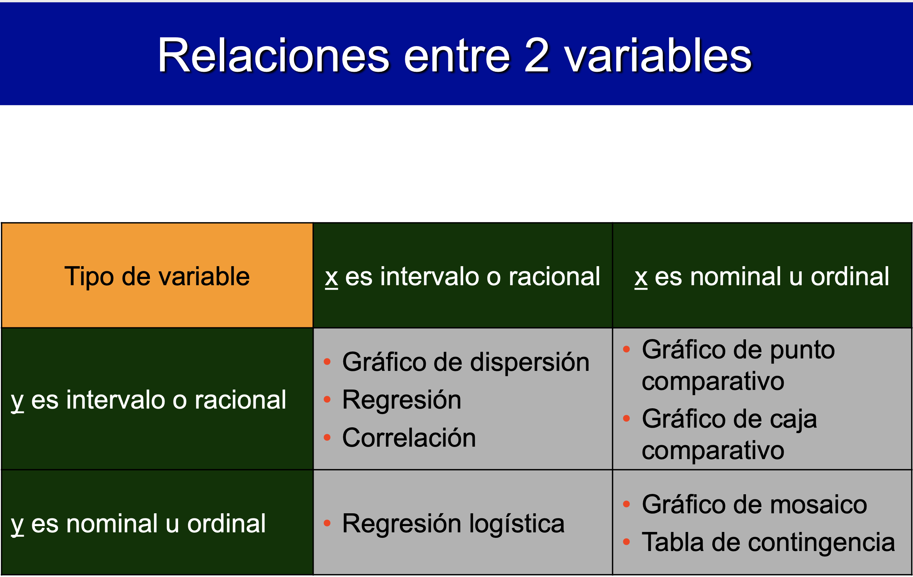

```{r}
library(tidyverse)
library(rio)
library(DescTools)
library(visdat)
library(knitr)
library(GGally)
library(SmartEDA)
library(inspectdf)
library(gapminder)
```


```{r}
pin <- import("03_datos/pinguinos.xlsx")
```

```{r}
head(pin)
```

```{r}
pin$species <- factor(pin$species)
pin$island <- factor(pin$island)
pin$sex <- factor(pin$sex)
```


```{r}
vis_dat(pin)
```

```{r}
ina <- inspect_na(pin)
ina
```

```{r}
show_plot(ina)
```

```{r}
pin <- na.omit(pin)
```


```{r}
it <- inspect_types(pin)
it
```

```{r}
show_plot(it)
```

```{r}
ExpData(data = pin, type = 1)
```

```{r}
ExpData(data = pin, type = 2)
```

```{r}
ExpNumStat(pin)
```

```{r}
ExpNumViz(pin)
```

```{r}
ExpCatViz(pin)
```

```{r}

```

```{r}
ggplot(pin, aes(body_mass_g)) +
  geom_histogram(fill = "dodgerblue3", bins = 5)
```

```{r}
ggplot(pin, aes(body_mass_g)) +
  geom_dotplot(fill = "dodgerblue3", dotsize = 0.7)
```

```{r}
ggplot(pin, aes(x = sex, y = body_mass_g)) +
  geom_boxplot(fill = "dodgerblue3") +
  geom_jitter(width = 0.2)
```

```{r}
ggplot(pin, aes(x = sex, y = body_mass_g)) +
  geom_violin(fill = "dodgerblue3")
```

```{r}
ggplot(pin, aes(x = sex, y = body_mass_g)) +
  geom_violin(fill = "dodgerblue3") +
  geom_dotplot(binaxis = "y", stackdir = "center")
```

```{r}
ggplot(pin, aes(species)) +
  geom_bar(fill = "dodgerblue3")
```

```{r}
pin_species <- pin %>%
  group_by(species) %>%
  summarize(conteo = n())
```
```{r}
pin_species
```

```{r}
ggplot(pin_species, aes(species, conteo)) +
  geom_col(fill = "dodgerblue3", width = 0.015) +
  geom_point(color = "orange", size = 4) +
  geom_text(aes(label = conteo), size = 2.5)
```

```{r}
ggplot(pin, aes(species, fill = sex)) +
  geom_bar()
```


```{r}

```


```{r}
ggplot(pin, aes(body_mass_g, flipper_length_mm)) +
  geom_point() +
  stat_smooth(method = "lm")
```

```{r}
ggpairs(pin, c("bill_length_mm", "bill_depth_mm", "body_mass_g"))
```

```{r}
data("gapminder")
```

```{r}
head(gapminder)
```


```{r}
gap <- gapminder %>% dplyr::filter(country %in% c("Costa Rica", "Uruguay", "Spain", "France"))
```

```{r}
head(gap)
```


```{r}
ggplot(gap, aes(year, gdpPercap, group = country, color = country)) +
  geom_point() +
  geom_line() +
  geom_label(aes(label = round(gdpPercap, 0)), size = 2)
```


